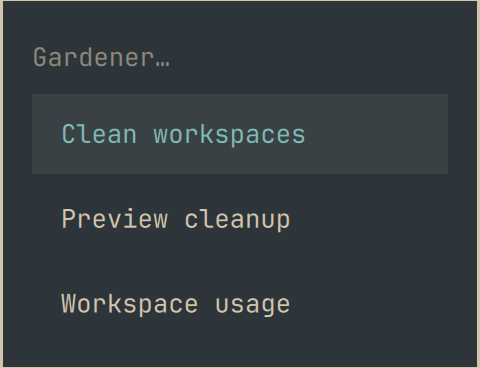
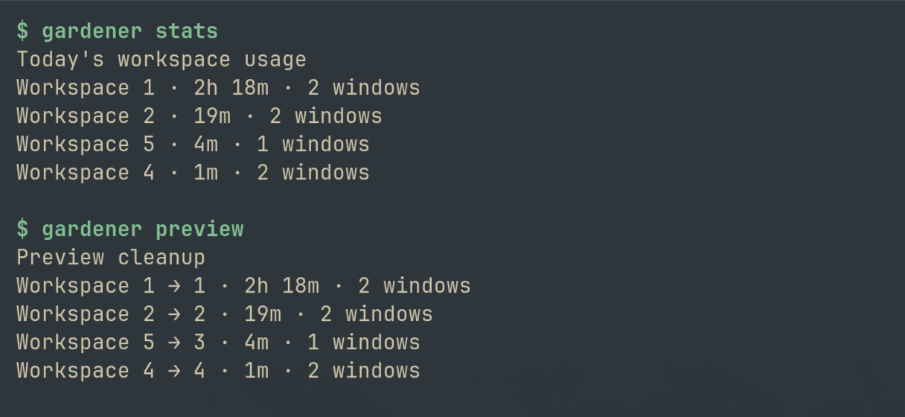

# Gardener

Gardener tracks today's focused time per workspace and tidies workspace numbers
when you ask. Your most-used workspace gets the lowest available number, followed
by the next most-used workspace. It runs as a headless Omarchy shell service,
with a native Gardener submenu and a small Python CLI.

Licensed under the [MIT License](LICENSE).

Requires Omarchy with shell plugins and the native JSONC menu, Hyprland workspace
`change_id` support, and Python 3. There are no additional Python dependencies or
background Python processes.

## Install

Keep this checkout in a permanent location, then run from a running Omarchy session:

```sh
python3 install.py
# Optional application launcher:
python3 install.py --desktop
```

The installer links the checkout into
`~/.config/omarchy/plugins/io.github.davefano.gardener`, links `gardener.py` as
`~/.local/bin/gardener`, and enables the service through Omarchy's plugin CLI.
Add `~/.local/bin` to your `PATH` if your shell does not already include it.

The Gardener menu contains **Clean workspaces**, **Preview cleanup**, and
**Workspace usage**. Existing menu content is preserved; changes live in a marked
block in `~/.config/omarchy/extensions/omarchy-menu.jsonc`. Each menu change makes
a timestamped backup next to that file. Installation is repeatable and refuses
conflicting links, menu entries, or application launchers. If enabling the plugin
fails, resolve the reported error and rerun the installer.

## Use

Press **Super+Space → Gardener** to open the native menu:



| Command | What it does |
| --- | --- |
| **Clean workspaces** | Reorder eligible workspaces by today's focused time and close numbering gaps. |
| **Preview cleanup** | Show the proposed moves without applying them. |
| **Workspace usage** | Show today's focused time, including workspaces protected from cleanup. |

### A typical cleanup

1. **Work normally.** Gardener counts time on the focused workspace while the
   service is running. Let it collect some usage before your first cleanup.
2. **Check Workspace usage.** See which workspaces you have spent the most time
   on today.
3. **Choose Preview cleanup.** Review the proposed numbers. Each arrow reads
   `current workspace → proposed workspace`; `1 → 1` means that workspace stays put.
4. **Choose Clean workspaces.** Gardener applies the ranking to whole workspaces,
   keeps their windows together, and refreshes the shell. The bar briefly disappears
   while the shell reloads. Your usage counters follow the new numbers.

Menu actions display their results in desktop notifications. For a report that
stays visible, run the same commands in a terminal:



In this capture, workspace **1** has the most focused time and stays at **1**.
Workspace **5** ranks third, so cleanup would move it to **3**, filling the gap.
Workspaces **2** and **4** keep their numbers. This screenshot shows a preview;
no cleanup has been applied. Your times and proposed moves will depend on your
current workspaces and protected slots. Cleanup recalculates the plan when you run
it, so it can differ from an earlier preview if usage or workspaces have changed.

### Terminal commands

The same actions are available from the terminal:

```sh
gardener                 # Open the Gardener submenu
gardener stats           # Today's focused workspace time
gardener preview         # Show the proposed cleanup
gardener tidy            # Apply cleanup
gardener recover         # Recover an interrupted cleanup transaction
gardener stats --json    # Machine-readable output
gardener preview --json
gardener tidy --json
```

`omarchy menu summon gardener` opens the same submenu. Each subcommand accepts
`--notify` to show its result as a desktop notification; the menu uses this flag.

## How it works

### Track focused time

Gardener listens for Hyprland workspace and monitor focus events inside Omarchy's
existing Quickshell process. Only the focused workspace accumulates time, even
when several monitors show different workspaces. Tracking starts when the plugin
is enabled; it cannot reconstruct earlier activity.

Tracking pauses on the lock screen, while a special workspace is open on the
focused monitor, and after 120 seconds without input. The first 120 seconds of
inactivity count as focused time; idle inhibitors do not prevent the pause.
A monotonic timer measures elapsed time and excludes suspend time.

"Today" means the local calendar day. Counters reset for a new day and when
Hyprland starts a new compositor session. Destroying a workspace discards its
counter, so a new workspace using the same number starts fresh. An Omarchy shell
restart restores saved counters for surviving workspaces in the same session.

### Rank and compact on command

When you choose **Clean workspaces**, Gardener sorts occupied, eligible numbered
workspaces by today's focused time, highest first. Ties use the existing workspace
number, lowest first. It assigns the lowest available numbers starting at 1,
skipping protected slots.

For example, with no protected slots:

| Workspace before cleanup | Today's focused time | Workspace after cleanup |
| --- | --- | --- |
| 12 | 2h 10m | 1 |
| 5 | 45m | 2 |
| 13 | 10m | 3 |

The two hours recorded for workspace 12 now belong to workspace 1. Tracking alone
never reorders workspaces; you decide when to run cleanup.

Named, persistent, empty, and workspace-rule-bound slots are reserved. Special
workspaces are excluded. Protected slots can leave intentional numbering gaps.
Application rules that target a fixed workspace number should also be protected
using the pinned list below. Reserve additional numbers in
`~/.config/gardener/config.json`:

```json
{"pinned": [1, 2]}
```

Pins reserve numbers even when those workspaces do not currently exist. If a
workspace selector rule cannot be handled safely, cleanup stops with an explanation.

### Preserve layouts during cleanup

Gardener changes whole workspace IDs through Hyprland's `change_id` dispatcher.
Windows stay grouped in their existing layouts, on their existing monitors, with
the focused window preserved. Cleanup does not close windows or merge workspaces.

The command pauses tracking and saves a recovery journal before making changes.
It first moves affected workspaces to unused temporary numbers, then assigns their
final numbers. This lets workspaces swap places without colliding. After verifying
window membership, it transfers the counters to the new numbers and saves them.

A successful cleanup reloads the entire Omarchy shell so its stock workspace bar
reflects the new IDs. The bar disappears briefly during that reload. If everything
is already in order, no reload is needed.

If a move fails, Gardener attempts to restore the original numbering and counters.
For an interrupted cleanup, run `gardener recover` before trying again. Recovery
retains the journal and reports an error if window membership has changed enough
that it cannot safely restore the original groups.

### Keep background work small

The service keeps counters in memory and responds to events instead of repeatedly
polling Hyprland. While counting, one timer checkpoints usage every 60 seconds;
it also saves at pause boundaries and shutdown. Python runs once at service
startup to read the initial workspace state, then only when a command is invoked.
There is no separate tracking daemon or recurring Python process.

Usage stays local in `~/.local/state/omarchy/gardener/state.json`. The service
stores workspace IDs and durations, without collecting window titles or browsing
history. Cleanup temporarily records window addresses in its recovery journal.
Gardener makes no network requests and sends no telemetry. Tracking stops while
the Omarchy shell is stopped.

## Development checks

Run `python3 -m unittest -v` and `node --test test_model.cjs`. See
[VERIFICATION.md](VERIFICATION.md) for live-test evidence and operational checks.

## Uninstall

```sh
python3 install.py --uninstall
```

This disables the service and removes only Gardener's matching links, marked menu
block, and optional desktop entry. Usage state, pinned-workspace configuration,
and menu backups remain. Keep the checkout at its installed location until
uninstalling; a checkout at a different location will refuse the existing links.

`XDG_CONFIG_HOME`, `XDG_DATA_HOME`, and `XDG_STATE_HOME` override their respective
default locations. The CLI link remains in `~/.local/bin`.

## License

Gardener is licensed under the [MIT License](LICENSE).
Copyright (c) 2026 Dave Fano. See the license file for the full terms.
